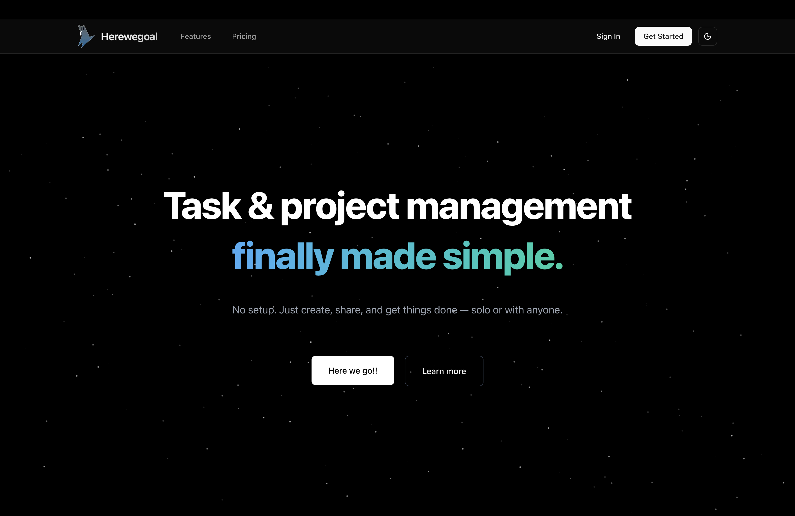

# HereWeGoal - Your Tasks, Simplified. Your Goals, Achieved. 🎯



## Overview

A personal task manager that just works. No complexity, no distractions - just you and your goals. Start in seconds, achieve more every day.

## 🚀 What You Get

- **Simple & Clean** - No unnecessary features. Just what you need to get things done.
- **Quick Sharing** - Share tasks with a simple link. No sign-up needed.
- **Work Your Way** - Organize tasks how you want, not how others think you should.
- **Start in Seconds** - Jump right in. No tutorials needed.

## 🛠 Built With

- Next.js 15.2.0-canary.74
- React 19.0.0
- TypeScript
- Tailwind CSS 
- Shadcn UI

## 🔧 Getting Started

1. Visit [herewegoal.com](https://herewegoal.com)
2. Create your first task
3. Start achieving your goals

## For Developers

### Setup

```bash
# Install dependencies
pnpm install

# Start development server
pnpm dev
```

Open [http://localhost:3000](http://localhost:3000) to start.

## 📞 Need Help?

- Website: [herewegoal.com](https://herewegoal.com)

## ⭐️ Show your support

Give a ⭐️ if this project helped you!

---

Built with simplicity in mind 🎯
